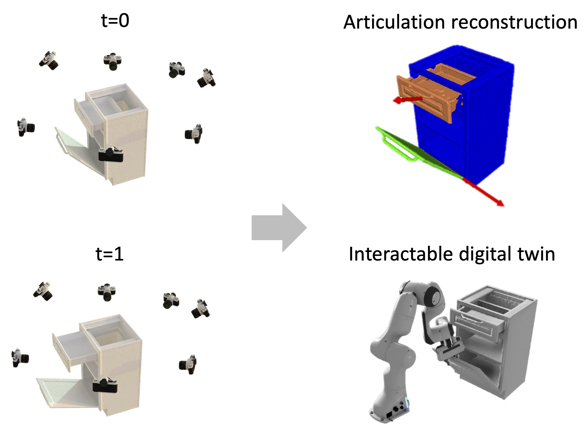

# Neural Implicit Representation for Building Digital Twins of Unknown Articulated Objects (CVPR 2024)

Yijia Weng, Bowen Wen, Jonathan Tremblay, Valts Blukis, Dieter Fox, Leonidas Guibas, Stan Birchfield

[project](https://nvlabs.github.io/DigitalTwinArt/) | [arxiv](https://arxiv.org/abs/2404.01440)


<div style="display: table-cell; vertical-align:middle; text-align:center;">
  
  
</div>

We tackle the problem of building digital twins of unknown articulated objects from two RGBD scans of the object at different articulation states. We decompose the problem into two stages, each addressing distinct aspects. Our method first reconstructs object-level shape at each state, then recovers the underlying articulation model including part segmentation and joint articulations that associate the two states. By explicitly modeling point-level correspondences and exploiting cues from images, 3D reconstructions, and kinematics, our method yields more accurate and stable results compared to prior work. It also handles more than one movable part and does not rely on any object shape or structure priors.

## Installation

### Clone Repository

```bash
git clone --recursive git@github.com:HalfSummer11/artnerf.git
```

### Install Dependencies

We recommend using [Anaconda](https://www.anaconda.com/) to manage dependencies. Run `./env.sh` to install all dependencies in a dedicated conda environment `artnerf`. Our code has been tested on Ubuntu 20.04, CUDA 11.3.

  ```bash
  bash env.sh
  ```

### Download Data


Please download [our preprocessed, depth-augmented version](https://drive.google.com/file/d/1e_HWjw4usNHAkXkg6_o3QvfLD-YPR-1W/view?usp=drive_link) of [PARIS two-part object dataset](https://github.com/3dlg-hcvc/paris?tab=readme-ov-file#data) and [our synthetic multi-part object dataset](https://drive.google.com/file/d/186EskU7WtLU8CMgwY2swRUn5AB_fQ-qK/view?usp=drive_link) and unzip them into `./data` under project root. 

```bash
artnerf
├── data                    
│   ├── paris
│   │    ├── [instance]        
│   │    └── ...
│   └── multi-part           
│        ├── [instance]  
│        └── ... 

```


## Training and Evaluation

### Generate 2D pixel matches with LoFTR

We provide 2D pixel matches generated with LoFTR under each instance folder `${dataset}/${instance}/correspondence_loftr/no_filter`. You could also generate them from scratch. 

To start with, follow the instruction in [LoFTR](https://github.com/zju3dv/LoFTR?tab=readme-ov-file#installation) and download their model weights into `external/LoFTR/weights`.

Run the following to generate pixel matches for `${dataset}/${instance}`.


```bash
cd preproc
python gen_correspondence.py \\
       --data_path ../data/${dataset}/${instance} \\
       --output_path ../data/${dataset}/${instance}/correspondence_loftr \\
       --top_k=30
```


### Training 

Run the following to reconstruct an articulated object from `${dataset}/${instance}`. 
```bash
python main.py \\
       --data_dir data/${dataset}/${instance} \\
       --cfg_dir config/release/ \\
       --num_parts ${num_parts} \\   # 2 for paris two-part objects, 3 for synthetic multi-part objects
       --save_dir runs/exp_${dataset}_${instance} 
       # --denoise  # enable denoising for real instances including paris/real_storage and paris/real_fridge
```
Checkpoints and reconstructions will be written to `runs/exp_${instance}`. Final results can be found in `runs/exp_${instance}/results/step_0004000`, including reconstructed part-level meshes (e.g. `init_part_0.obj`), axis meshes (e.g. `init_axis_0_revolute.obj`), and quantitative evaluations in `all_metrics`.


### Inference

You could also download [our pretrained checkpoints](https://drive.google.com/file/d/15Nn2fo13URJ9IUzQXRQ4sWsum7ZSzhmA/view?usp=drive_link) and unzip them into `./runs` under project root. 

Run the following to generate a reconstruction from the checkpoint.

```bash
python main.py \\
       --data_dir data/${dataset}/${instance} \\
       --cfg_dir config/release/ \\
       --num_parts ${num_parts} \\   # 2 for paris two-part objects, 3 for synthetic multi-part objects
       --save_dir runs/pretrained_${dataset}_${instance}  \\
       --ckpt_path runs/pretrained_${dataset}_${instance}/ckpt/model_latest.ckpt \\
       --test_only 
       # --denoise  # enable denoising for real instances including paris/real_storage and paris/real_fridge
```

### Evaluation

Evaluations are automatically run after each reconstruction. Results are written to both the terminal and `all_metrics` in the corresponding results folder. You may also run the following to evaluate both the geometry and joint parameters of the predicted reconstruction (e.g. in `${exp_dir}/results/step_0004000`) offline. 

```bash
python eval/eval_results.py --gt_path data/${dataset}/${instance}/gt --pred_path runs/${exp_dir}/results/step_${step_cnt}
```


## Citation


```
@inproceedings{weng2024neural,
    title={Neural Implicit Representation for Building Digital Twins of Unknown Articulated Objects}, 
    author={Yijia Weng and Bowen Wen and Jonathan Tremblay and Valts Blukis and Dieter Fox and Leonidas Guibas and Stan Birchfield},
    booktitle={CVPR},
    year={2024}
}
```


## Acknowledgements

This implementation is based on the following repositories. We thank the authors for open sourcing their great works!

+ [[CVPR 2023] BundleSDF: Neural 6-DoF Tracking and 3D Reconstruction of Unknown Objects](https://github.com/NVlabs/BundleSDF)
+ [[ICCV 2023] PARIS: Part-level Reconstruction and Motion Analysis for Articulated Objects](https://github.com/3dlg-hcvc/paris)
